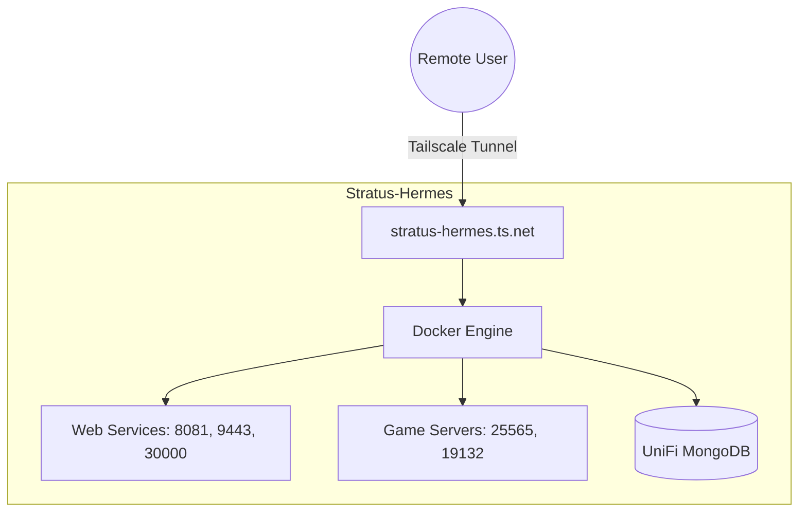

# 🏛️ Stratus-Hermes Node

**Host OS:** Ubuntu LTS 24.04.3 Headless  
**Docker Version:** 29.2.1  
**Tailscale Access:** [stratus-hermes.ts.net](https://tailscale.com)

---

## 🚀 Service Dashboard


| Service | Access Link | Host Port | Status |
| :--- | :--- | :--- | :--- |
|  | `https://stratus-hermes.ts.net:30000` | `30000` | Game Server |
|  | `https://stratus-hermes.ts.net:8081` | `8081` | Passwords |
|  | `https://stratus-hermes.ts.net:9443` | `9443` | Management |
|  | `https://stratus-hermes.ts.net:8443` | `8443` | Networking |
|  | `https://stratus-hermes.ts.net:25565` | `25565` | PaperMC (Java) |
|  | `https://stratus-hermes.ts.net:19132` | `19132` | Bedrock Bridge |

---

## 🛠️ Infrastructure Design
The node operates as a single-node Docker host. All services are bound to the host network interface and routed through the [Tailscale](https://tailscale.com) overlay network.



---

## 📂 Data & Persistence
All persistent data is consolidated under `/srv/` for simplified backups.


| Container | Host Path |
| :--- | :--- |
| **Weyland Tavern** | `/srv/storage/weylandtavern` |
| **Foundry** | `/srv/storage/foundry/data` |
| **Portainer** | `/srv/storage/portainer` |
| **Minecraft** | `/srv/storage/minecraft` |
| **Vaultwarden** | `/srv/storage/vaultwarden` |
| **UniFi DB** | `/srv/storage/unifi/db` |

---

## 🔧 Maintenance
To update all services to their latest versions while preserving data:

```bash
# Pull latest images and restart containers
docker compose pull && docker compose up -d --remove-orphans
```

---

## 📟 Hardware Specs
*   **Chassis:** 2U Micro ATX Compact Rackmount
*   **CPU:** Intel i7 2600k
*   **RAM:** 16GB DDR3
*   **Motherboard:** [Asus P8H67-I Deluxe](https://www.asus.com)
*   **Storage:** 120GB + 1TB SSDs
*   **Network:** Intel Gigabit Ethernet
*   **Power Supply:** 500W